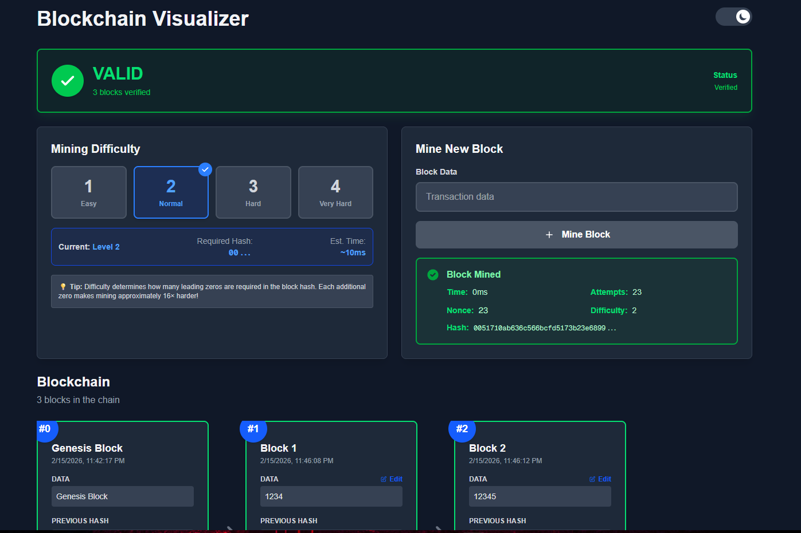

# ⛓️ Blockchain Visualizer

An interactive web application that demonstrates how blockchain technology works through real-time visualization. Built for educational purposes to help understand cryptographic hashing, proof-of-work mining, and chain validation.


## � Live Demo

**[View Live Demo →](https://blockchain-demo-jnwync.vercel.app/)**

## �🎯 Features

### Core Features

- **📊 Visual Blockchain Display**: See each block with all details (index, timestamp, data, previous hash, nonce, hash)
- **⛏️ Interactive Mining**: Mine new blocks using proof-of-work algorithm with real-time feedback
- **✓ Chain Validation**: Live validation indicator showing chain integrity (green = valid, red = invalid)
- **🎚️ Difficulty Levels**: Adjust mining difficulty (1-4) and watch the mining time increase
- **🔧 Tampering Demo**: Edit block data to see how blockchain detects tampering immediately
- **📜 Transaction Ledger**: View complete transaction history in chronological order

### What You'll Learn

- How blocks link together through cryptographic hashes
- How proof-of-work mining secures the blockchain
- Why tampering with blockchain data is detectable
- How chain validation works
- The relationship between difficulty and mining time

## 🚀 Getting Started

### Prerequisites

- Node.js 18+ installed
- npm or yarn package manager

### Installation

1. Clone the repository:
```bash
git clone https://github.com/yourusername/blockchain-demo.git
cd blockchain-demo
```

2. Install dependencies:
```bash
npm install
```

3. Run the development server:
```bash
npm run dev
```

4. Open your browser and navigate to:
```
http://localhost:3000
```

## 🎮 How to Use

### 1. Mine New Blocks
- Enter transaction data in the mining form (e.g., "Alice pays Bob 10 coins")
- Click "Mine Block" to start the proof-of-work process
- Watch as the system finds a valid nonce and adds the block to the chain

### 2. Adjust Difficulty
- Select difficulty levels 1-4 using the difficulty selector
- Higher difficulty = more leading zeros required = longer mining time
  - **Level 1**: ~milliseconds
  - **Level 2**: ~10ms (default)
  - **Level 3**: ~100ms
  - **Level 4**: ~1-2 seconds

### 3. Tamper with the Blockchain
- Click "Edit" on any non-genesis block
- Change the data without re-mining
- Watch the validation indicator turn red
- See how the tampered block and all subsequent blocks become invalid

### 4. View Transaction History
- Scroll down to the Transaction Ledger
- See all blocks listed chronologically
- View statistics (total blocks, transactions, last nonce)

## 🏗️ Project Structure

```
blockchain-demo/
├── app/                      # Next.js App Router
│   ├── page.tsx             # Main application page
│   ├── layout.tsx           # Root layout
│   └── globals.css          # Global styles
├── components/              # React components
│   ├── BlockCard.tsx        # Individual block display
│   ├── BlockChainView.tsx   # Chain visualization
│   ├── MiningForm.tsx       # Mining interface
│   ├── ValidationIndicator.tsx  # Chain validity display
│   ├── DifficultySelector.tsx   # Difficulty control
│   └── TransactionLedger.tsx    # Transaction history
├── lib/                     # Core blockchain logic
│   ├── blockchain/
│   │   ├── Block.ts         # Block class
│   │   ├── Blockchain.ts    # Blockchain class
│   │   ├── types.ts         # TypeScript interfaces
│   │   └── index.ts         # Public exports
│   └── utils/
│       └── formatters.ts    # Utility functions
├── hooks/                   # Custom React hooks
│   └── useBlockchain.ts     # Blockchain state management
└── docs/                    # Documentation
    ├── IMPLEMENTATION_PLAN.md
    ├── ARCHITECTURE.md
    └── [other documentation files]
```

## 🛠️ Technology Stack

- **Framework**: [Next.js 16.1.6](https://nextjs.org/) with App Router
- **Language**: [TypeScript 5](https://www.typescriptlang.org/)
- **Styling**: [Tailwind CSS 4](https://tailwindcss.com/)
- **Cryptography**: [crypto-js](https://github.com/brix/crypto-js) (SHA-256 hashing)
- **State Management**: React Hooks (useState, useEffect, useCallback)

## 📚 Key Concepts Demonstrated

### Hashing (SHA-256)
Each block's hash is calculated using SHA-256, a cryptographic hash function that produces a unique 64-character hexadecimal output.

### Proof-of-Work Mining
The mining process finds a nonce value that produces a hash starting with a specific number of zeros (determined by difficulty).

### Chain Linking
Each block contains the hash of the previous block, creating an unbreakable chain. Changing any block breaks all subsequent links.

### Validation
The system checks:
- Each block's hash is correctly calculated
- Each block's previousHash matches the previous block's hash
- The genesis block is valid

## 🎨 Screenshots



## 📖 Documentation

For detailed implementation information, see:

- [Implementation Plan](docs/IMPLEMENTATION_PLAN.md) - Complete development roadmap
- [Architecture](docs/ARCHITECTURE.md) - System design and patterns
- [Blockchain Concepts](docs/BLOCKCHAIN_CONCEPTS.md) - Theory and fundamentals

## 🤝 Contributing

This is an educational project built for learning purposes. Feel free to fork and experiment!

## 📝 License

This project is open source and available under the MIT License.

## 🙏 Acknowledgments

Built as an educational tool to help understand blockchain technology. Inspired by blockchain fundamentals from Bitcoin and Ethereum.

---

**Made with ❤️ for learning blockchain concepts**
